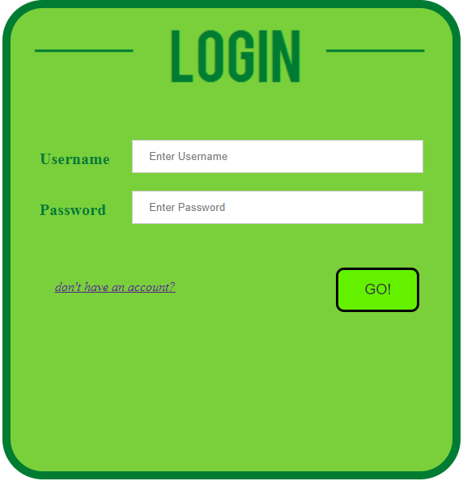
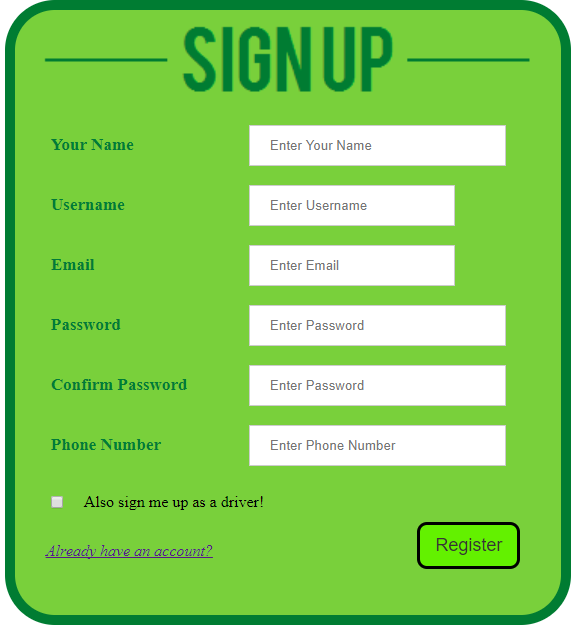
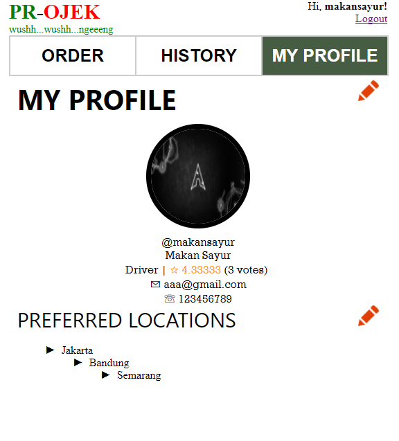
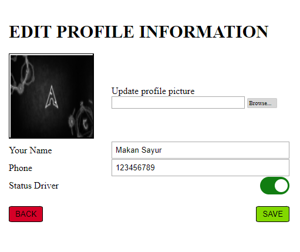
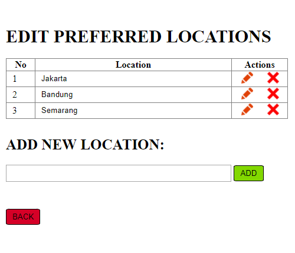
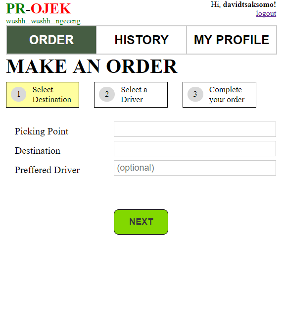
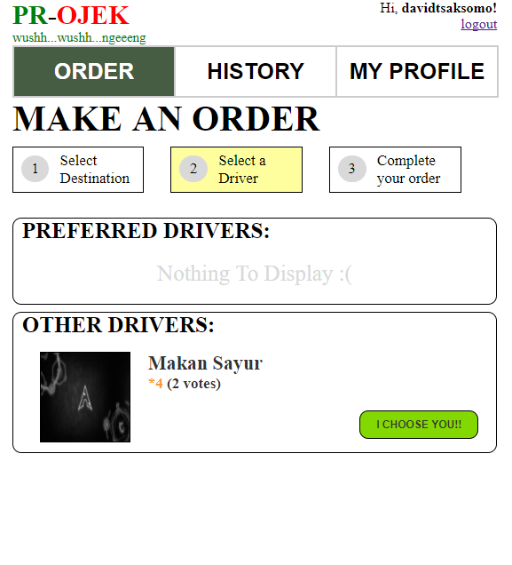
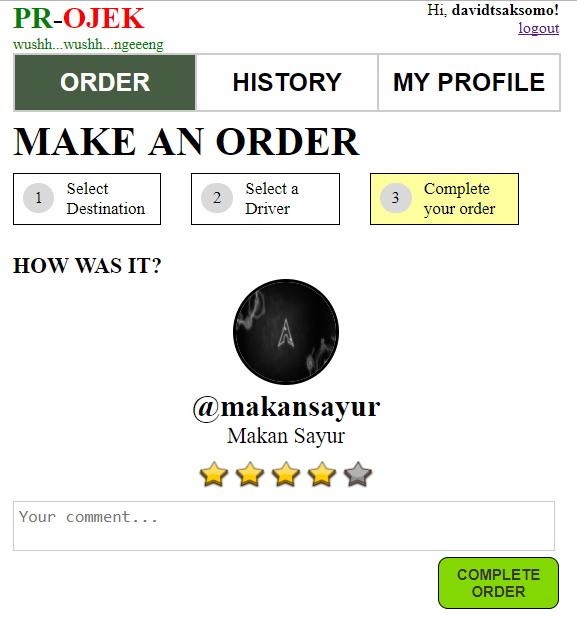
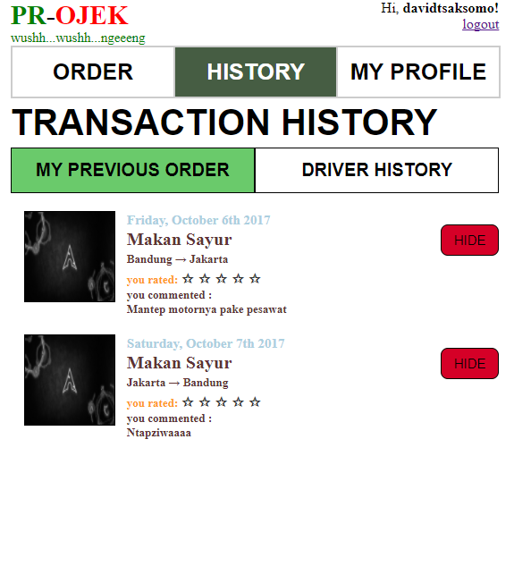
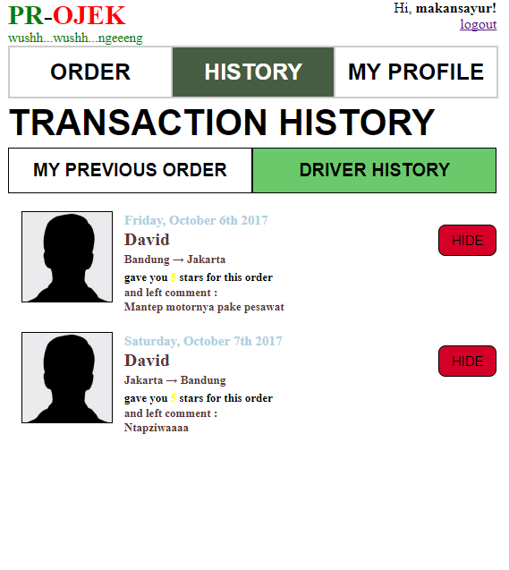

# Tugas 1 IF3110 Pengembangan Aplikasi Berbasis Web

Membuat sebuah Website Ojek Online **PR-OJEK**

## Deskripsi Singkat

Fitur utama dari aplikasi ini adalah *order ojek*. Dengan fitur tersebut, penumpang dapat menggunakan fitur tersebut untuk memesan ojek untuk posisi dan tujuan tertentu yang diinginkan penumpang. Penumpang juga dapat memilih driver yang diinginkan. Penumpang juga dapat memberi *rating* dan pesan kepada driver.

Fitur lain yang ditawarkan aplikasi ini adalah fitur *history*, baik untuk penumpang dan untuk driver. Aplikasi ini juga memiliki fitur *profile*, dimana pengguna dapat melihat dan mengatur informasi pripadi yang dimilikinya, termasuk statusnya pada aplikasi ini dapat diubah menjadi driver atau bukan driver sesuai keinginan pengguna.

## Tampilan Website

### Login

Pengguna dapat melakukan login sebagai user. Halaman ini merupakan halaman pertama yang dibuka oleh pengguna ketika menjalankan aplikasi.

### Register

Pengguna dapat mendaftarkan diri sebagai user agar dapat menggunakan aplikasi ini. Satu user akan memiliki satu akun yang dapat digunakan sebagai penumpang maupun sebagai driver. User disediakan opsi untuk memilih untuk menjadi driver atau tidak saat registrasi. Setelah selesai register, jika pengguna tidak memilih opsi untuk menjadi driver, pengguna otomatis masuk ke halaman Order dengan keadaan sudah login. Jika pengguna memilih opsi menjadi driver, pengguna otomatis masuk ke halaman Profile dengan keadaan sudah login.

### Profile

Pada halaman ini, ditampilkan username, nama lengkap, email, dan nomor HP. Selain itu, ditampilkan keterangan apakah pengguna merupakan driver atau bukan. Jika pengguna merupakan driver, ditampilkan tulisan Driver diikuti rating dan jumlah vote seperti terlihat pada gambar. Jika pengguna bukan driver, ditampilkan tulisan Non-Driver, tanpa diikuti rating. Pada bagian kanan atas, terdapat tombol edit, jika pengguna menekan tombol tersebut, pengguna dibawa ke halaman Edit-Profile.

Pada bagian bawah, terdapat Preferred Location, yang berisi daftar lokasi yang dilayani pengguna jika berperan sebagai driver. Bagian ini ditampilkan jika pengguna merupakan driver. Pada bagian kanan atas, terdapat tombol edit, jika pengguna menekan tombol tersebut, pengguna dibawa ke halaman Edit-Preferred-Location.

### Edit-Profile

Pada halaman ini, pengguna dapat mengedit nama yang ditampilkan, nomor telepon, foto, dan status driver.

Pada bagian bawah halaman, terdapat tombol Back dan Save. Jika tombol Back ditekan, pengguna kembali ke halaman Profile tanpa dilakukan perubahan pada informasi pengguna. Jika tombol Save ditekan, pengguna dibawa ke halaman Profile dan informasi pengguna diperbaharui sesuai perubahan yang dilakukan pengguna.

### Edit-Preferred-Location

Pada Edit-Preferred-Location, ditampilkan lokasi-lokasi yang dapat dicapai jika menjadi driver. Pada tiap baris lokasi, ada tombol Delete untuk menghapus lokasi.

Pada bagian Add New Location, terdapat sebuah text area dan sebuah tombol Add. Pada text area, pengguna dapat mengisikan lokasi untuk ditambahkan, lalu menekan tombol Add untuk menambahkan lokasi.

Jika tombol Back ditekan, pengguna dibawa kembali ke halaman Profile.

Ketika tombol edit ditekan, pengguna dapat mengedit lokasi pada baris tertentu, dan tombol edit berubah menjadi tombol save. Jika tombol save ditekan, lokasi akan berubah.

### Order-Ojek

Order-Ojek merupakan halaman utama yang ditampilkan ketika penumpang telah login. Pada halaman Order-Ojek, terdapat sebuah form yang dapat diisi pengguna untuk melakukan order.

Setelah pengguna mengisi field-field pada form order dan menekan tombol order, pengguna akan dibawa ke halaman Select-Driver. Seluruh field wajib diisi, kecuali field "Preferred Driver".

### Select-Driver

Pada halaman ini, ditampilkan driver-driver yang tersedia dan dapat mengambil order. Driver yang dapat mengambil order adalah pengguna yang menjadi driver, dan memiliki alamat asal *atau* alamat tujuan pada "Preferred Location"-nya.

Halaman ini terdiri atas dua bagian, yaitu "Preferred Driver" dan "Other Drivers". Bagian "Preferred Driver" akan terisi dengan driver-driver dengan nama yang diisikan pengguna pada field "Preferred Driver" saat melakukan order. Jika pengguna tidak mengisikan field "Preferred Driver" atau tidak ada driver dengan nama yang diisikan pada field "Preferred Driver", bagian Preferred Driver akan kosong.

Pada bagian "Other Drivers", ditampilkan seluruh driver yang dapat mengambil order tersebut.

Setelah memilih driver dan menekan tombol Confirm, pengguna dibawa ke halaman Complete-Order.

### Complete-Order

Pada halaman Complete-Order, akan ditampilkan informasi driver dan order, serta opsi untuk memberikan rating dan komentar. Setelah pengguna submit rating dan komentar untuk driver, pengguna dibawa ke halaman Order-Ojek.

### History

Pada halaman history, terdapat dua tab, yaitu History Penumpang dan History Driver. History Penumpang menampilkan daftar order yang pernah diambil pengguna sebagai penumpang, dan History Driver menampilkan daftar order yang pernah diambil pengguna sebagai driver.

Pada tiap entri pada history, terdapat tombol hide. Jika tombol hide ditekan, history yang bersangkutan tidak akan ditampilkan.

## Pembagian Tugas

**Tampilan**
1. Login : 13515014
2. Register : 13515014
3. Profile : 13515059
4. Edit Profile : 13515059
5. Edit Preferred Location : 13515059
6. Order : 13515131
7. Select Driver : 13515131
8. Complete Order : 13515131
9. History : 13515014

**Fungsionalitas**
1. Login : 13515014
2. Register : 13515014
3. Profile : 13515059
4. Edit Profile : 13515059, 13515131
5. Edit Preferred Location : 13515059
6. Order : 13515131
7. Select Driver : 13515131
8. Complete Order : 13515131
9. History : 13515014

## About

**Team7**
Anggota kelompok :
* M. Ferdi Ghozali - 13515014
* David Theosaksomo - 13515131
* Muthmainnah - 13515059
"# WBD-Tubes1-PrOjek" 
